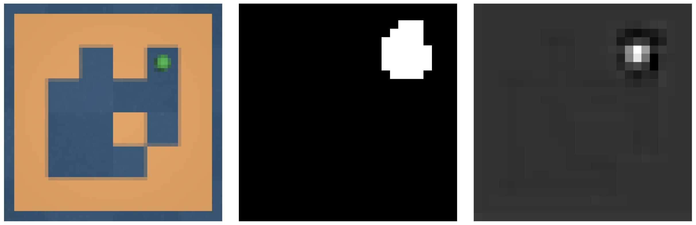
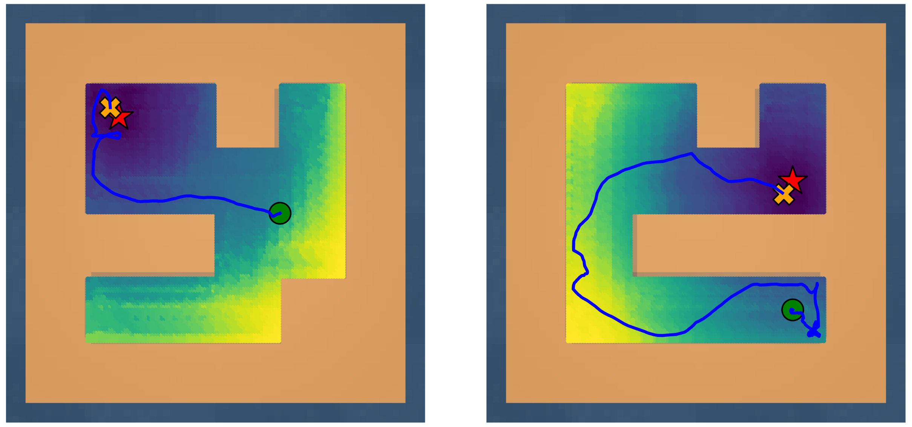

# Learning to Plan in Latent Space with Joint-Embedding Predictive Architectures

This repository contains the code, experiments, and supplementary material for my Master’s thesis:

**Learning to Plan in Latent Space with Joint-Embedding Predictive Architectures**
Gabriele Gavino Pintus
MSc in Data Science and Artificial Intelligence, University of Trieste
Supervisors: Prof. Luca Bortolussi, Prof. Alfredo Canziani (NYU)


You can find the full thesis [here](resources/Thesis.pdf) and the slides [here](resources/Slides.pdf).


## 📘 Abstract

Autonomous agents require internal models of the world to predict, reason, and plan over long horizons. Traditional world models operate directly in observation space, which is high-dimensional, redundant, and poorly aligned with decision-making. Joint-Embedding Predictive Architectures (JEPA) offer an alternative by learning to predict future states in a compact representation space that captures only predictable components.

In this work, we study a JEPA-based world model for goal-conditioned visual navigation in the **PointMaze** environment. We introduce a learned **static–dynamic decomposition** via a mask that separates background structure from agent-dependent dynamics. The dynamics predictor operates exclusively on the dynamic latent component, improving robustness and predictability. The learned world model is integrated into a **Model Predictive Control (MPPI)** pipeline that performs planning entirely in latent space, achieving reliable navigation without access to ground-truth positions, maps, or rewards.


## 🧠 Key Contributions

* **JEPA world model for visual navigation** trained purely with self-supervision
* **Learned static–dynamic latent decomposition** via a mask extractor
* **Latent-space dynamics prediction** focused on agent-dependent components
* **Planning with MPPI entirely in representation space**
* Successful generalization to **unseen mazes** with frequent replanning


## 🏗️ Architecture Overview

The system consists of:

* **Visual Encoder**: maps RGB observations to a latent representation
* **Mask Network**: separates static and dynamic latent components
* **Dynamics Predictor**: predicts future dynamic latents conditioned on actions
* **Planner (MPPI)**: optimizes action sequences using the learned latent dynamics

Prediction is performed in representation space, avoiding pixel-level reconstruction and focusing only on predictable structure.


## 🌍 Environment & Data

* **Environment**: PointMaze (2D point-mass navigation)
* **Observations**:

  * RGB images (64 × 64)
  * Velocity (vx, vy)
* **Not provided**:

  * Absolute position (x, y)
  * Maze map
  * Reward signal

### Dataset

* 10,000 random trajectories (H = 100)
* 40 training mazes + 40 test mazes
* Collected with random exploration policies


## 🧪 Experiments & Results

* The learned mask correctly identifies **dynamic regions** corresponding to the agent

<div style="width: 600px; margin: 0 auto;">


</div>

* The latent space encodes **spatial geometry** and relative position
* MPPI planning in latent space achieves:

  * **Near-100% success rate** with frequent replanning
  * Robust generalization to unseen maze layouts


<div style="width: 600px; margin: 0 auto;">


</div>


## 📂 Repository Structure

```
.
├── configs/                # Lightning configuration files
├── data/                   # Datasets generated with trajectory_generator.py
├── env/                    # PointMaze environment code
├── src/                    # Main source code (models, training, planning, datasets)
├── resources/              # Thesis, slides and images
├── README.md               # This file
├── jepa-cli.py             # Main Lightning CLI entry point
├── make_maze_bank.py       # Maze generation script
├── split_maze_bank.py      # Script to split maze bank into train/test sets
├── trajectory_generator.py # Script to generate dataset trajectories
└── Visualization.ipynb     # Jupyter notebook for visualizing trained model
```


## 🚀 Training the model

```bash
python jepa-cli.py --config configs/jepa.yaml
```

> ⚠️ This repository is primarily intended for research and reproducibility rather than as a polished library.


## 🔭 Limitations & Future Work

* Euclidean latent cost ignores maze topology (walls)
* Position extraction from masks is non-differentiable
* Future directions:

  * Topology-aware cost functions
  * Uncertainty-aware latent dynamics
  * Hierarchical and multi-scale JEPA models


## 📚 References

If you use this code or build upon this work, please cite the thesis:

```
@mastersthesis{pintus2025jepa,
  title  = {Learning to Plan in Latent Space with Joint-Embedding Predictive Architectures},
  author = {Pintus, Gabriele Gavino},
  school = {University of Trieste},
  year   = {2025}
}
```

